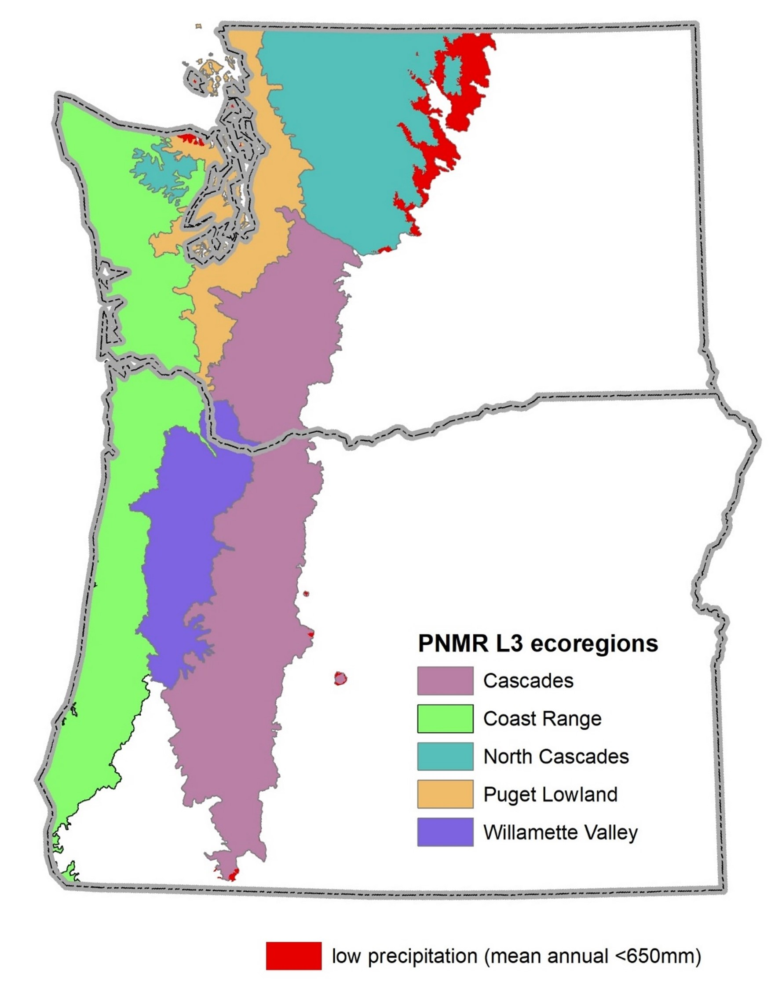

```{r setup, include=FALSE}
knitr::opts_chunk$set(echo = FALSE
                      , results = 'asis'
                      , warning = FALSE
                      , message = FALSE)
```

The BCGcalc Shiny app is a free R-based tool that calculates outputs for 
Biological Condition Gradient (BCG) models (
<a href="https://www.epa.gov/sites/default/files/2016-02/documents/bcg-practioners-guide-report.pdf" target="_blank">US EPA 2016</a>
). It is linked to the 
<a href="https://github.com/leppott/BCGcalc" target="_blank">BCGcalc</a> 
and 
<a href="https://github.com/leppott/BioMonTools" target="_blank">BioMonTools</a> 
R packages, which were developed by Erik W. Leppo (Erik.Leppo@tetratech.com) from Tetra Tech and are available on GitHub. 

This website is customized to calculate the BCG model for macroinvertebrate 
assemblages in freshwater wadeable streams in the Pacific Northwest Maritime 
Region (PNMR) of Oregon and Washington (Figure 1). It also calculates thermal preference metrics and probability of membership in cold, cool or warm-water communities, which can help inform restoration and protection efforts and 
climate resiliency. The user uploads input files to the website, which will 
generate the outputs without the use of R code. Those who prefer to work with R 
can download the R packages from the GitHub sites.  

The PNMR BCG model assigns samples to six levels of biological condition along a generalized stressor-response curve, ranging from observable biological 
conditions found at no or low levels of stressors (level 1) to those found at 
high levels of stressors (level 6) (Figure 2). The PNMR model was calibrated for macroinvertebrate communities in three classes of freshwater wadeable streams: 
low gradient (<1%)/lower elevation (<750 m); higher gradient (≥1%)/lower 
elevation (<750 m); and higher gradient (≥1%)/higher elevation (≥750 m). 

The model is intended to be applied to samples that meet the following criteria:

*	Freshwater wadeable streams

*	Within the following Omernik Level 3 ecoregions: Coast Range, Puget Lowland, Willamette Valley, Cascades, and North Cascades, excluding xeric regions (< 650 
mm mean annual precipitation) (Figure 1)

*	Total watershed area: 5 to 260 km2 (2 to 100 mi2)

*	Target number of organisms: 500. The number of individuals should not exceed 
600; if it does, random subsampling should be applied

*	Sampling effort: at least 8 ft2 sampling area 

*	Lowest practical taxonomic resolution based on current Standard Taxonomic
Effort guidelines (Wisseman et al. 2015)

*	Collection gear: D-Frame kick-nets or Surber net with 500-micrometer mesh net

*	Collection method: targeted-riffle or reachwide, multihabitat (Hayslip 2007)

*	Collection period: summer baseflow period (typically June through mid-October) 

Model calibration is described in detail in [Stamp 2022](links/PNMR_BCG_report_20220930_minusSupp.zip). 

```{r, echo=FALSE, out.width="50%", fig.cap="Figure 1. The Pacific Northwest Maritime Region (PNMR) of Oregon and Washington includes five Omernik Level 3 ecoregions: Coast Range, Puget Lowland, Willamette Valley, Cascades, and North Cascades, excluding xeric regions (< 650 mm mean annual precipitation)."}

```


## Funding 
Development of the BCGcalc and BioMonTools R packages have been funded by the 
United States Environmental Protection Agency (EPA) Office of Office of Science 
and Technology (OST) (lead EPA OST scientist: Susan Jackson) and Office of 
Research and Development (ORD) (lead EPA ORD scientist: Britta Bierwagen). 

## Contacts
If you encounter problems with the Shiny app and/or have suggestions on ways to further improve it, please contact Erik W. Leppo from Tetra Tech via email (Erik.Leppo@tetratech.com) or via a post on the 
<a href="https://github.com/leppott/BCGcalc/discussions" target="_blank">BCGcalc GitHub Discussions page</a>.

For more information on this project, or on the BCG in general, please contact 
Susan Jackson (Jackson.Susank@epa.gov).

## Literature cited
Davies, S. B., and S. K. Jackson. 2006. The Biological Condition Gradient: A descriptive model for interpreting change in aquatic ecosystems. Ecological Applications 16(4):1251–1266.

Hayslip, Gretchen, editor, 2007. Methods for the collection and analysis of 
benthic macroinvertebrate assemblages in wadeable streams of the Pacific 
Northwest. Pacific Northwest Aquatic Monitoring Partnership, Cook, Washington. www.pnamp.org/web/workgroups/SC/meetings/2007_0821/2007_0531PNAMP_macroinvert_protocol_final.pdf

Stamp, J. 2022. Calibration of the Biological Condition Gradient (BCG) for Macroinvertebrate Assemblages in Freshwater Wadeable Streams in the Pacific 
Northwest Maritime Region of Oregon and Washington. Prepared for US EPA Office 
of Science and Technology and US EPA Region 10.

USEPA (US Environmental Protection Agency). 2016. A Practitioner’s Guide to the Biological Condition Gradient: A Framework to Describe Incremental Change in 
Aquatic Ecosystems. Office of Water, Washington DC. EPA 842-R-16-001.

Wisseman, R., Sullivan, S., Pfeiffer, J. and S. Salter. 2015. Northwest Standard Taxonomic Effort. https://www.pnamp.org/project/northwest-standard-taxonomic-effort

*Last updated 2022-10-10*
