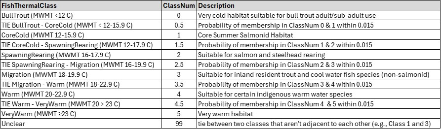

```{r setup, include=FALSE}
knitr::opts_chunk$set(echo = FALSE
                      , results = 'asis'
                      , warning = FALSE
                      , message = FALSE)
```

# Purpose

Use the macroinvertebrate thermal preference metrics to predict (fish-based)
temperature classes based on the Oregon and Washington regulatory temperature
standards. Samples are assigned to six thermal classes, ties between two 
classes, or are designated as ‘unclear’ if the  between classes that are not
adjacent. For more detailed information, see the write-up in the zipped package 
that you can download below (Word doc ‘ORWA_XGboost_20240619’).



# Recommended Workflow

1. Calculate thermal preference metrics, using either:

    +	The ‘thermal preference metric’ calculator in this Shiny app

    +	R code (see file titled ‘ThermMetricCalc_20240208’ in zipped package below, 
which is from the <a href="https://github.com/leppott/BioMonTools" target="_blank">BioMonTools</a> R package)  

2. Take the thermal preference metric output and run it through the
“PredictThermalClass.r” code provided in the zipped file below. There is also a
“fit.rds” file that must be present in the directory, and the input file must 
be a CSV file that is located in a folder called “Data.” The .r, .rds, and Data
folder must all be located at the same file system level. The R code creates a
“Predictions” folder that contains the results.

# Files to Download
Write up, R code and other accompanying files
[[ZIP]](links/FishThermalClass_20240619.zip)

Questions or problems? Contact Mark Fernandez (Mark.Fernandez@tetratech.com) 
and Jen Stamp (Jen.Stamp@tetratech.com)


---

*Last updated 2024-07-03*
