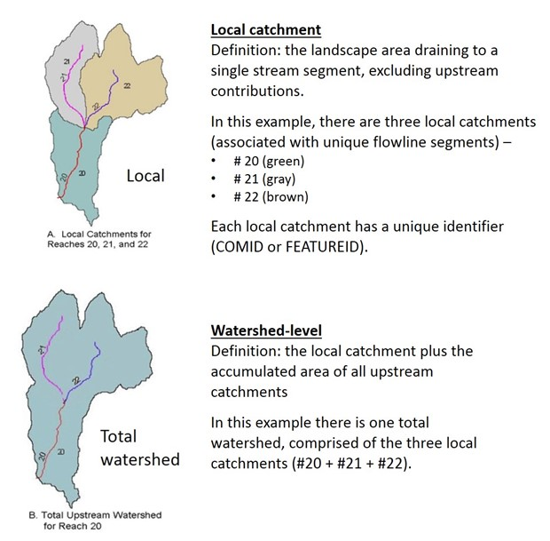
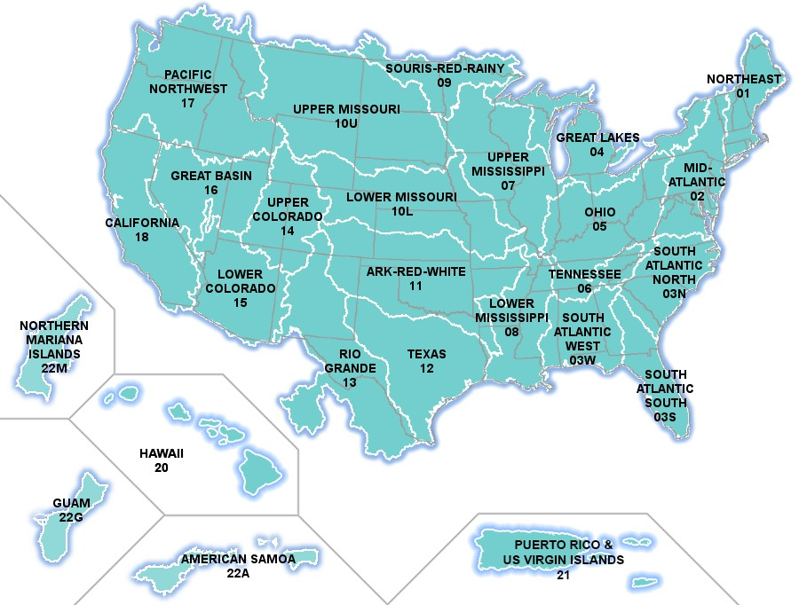
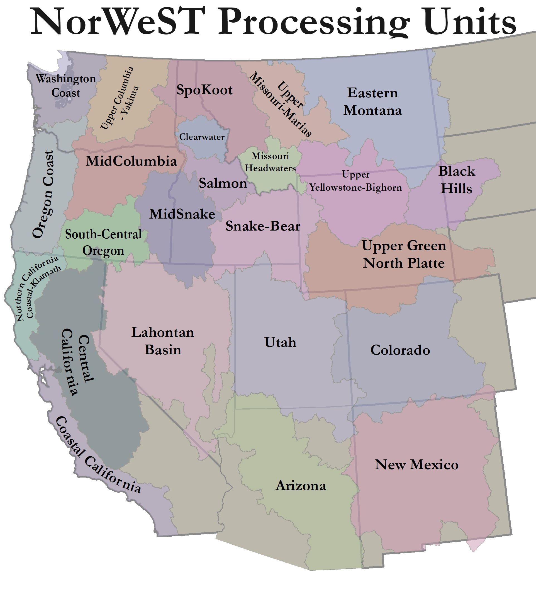

```{r setup, include=FALSE}
knitr::opts_chunk$set(echo = FALSE
                      , results = 'asis'
                      , warning = FALSE
                      , message = FALSE)
```

## EPA StreamCat 

<a href="https://www.epa.gov/national-aquatic-resource-surveys/streamcat-dataset" target="_blank">https://www.epa.gov/national-aquatic-resource-surveys/streamcat-dataset</a>

The USEPA StreamCat dataset (Hill et al. 2016) is an extensive database with 
hundreds of natural and anthropogenic landscape metrics for the conterminous US. 
Two of the metrics - the Indices of Watershed and Catchment Integrity (IWI & ICI
, respectively) (Thornbrugh et al. 2018, Johnson et al. 2019) – provide overall 
measures of watershed condition and are now commonly used as measures of general
anthropogenic disturbance in BCG projects. They are comprised of six components:
hydrologic regulation, regulation of water chemistry, sediment regulation, 
hydrologic connectivity, temperature regulation, and habitat provision. The IWI 
is based on total watershed scale (which includes the local catchment plus the 
accumulated area of all upstream catchments) and the ICI is based on local 
catchment scale (which is defined as the landscape area draining to a single 
stream segment, excluding upstream contributions) (Figure 1).
 


**Literature cited:**

Hill, R.A., Weber, M.H., Leibowitz, S.G., Olsen, A.R., & Thornbrugh, D.J. 2016. 
The Stream-Catchment (StreamCat) dataset: a database of watershed metrics for 
the conterminous United States. Journal of the American Water Resources 
Association, 52, 120-128.

Johnson, Zachary & G. Leibowitz, Scott & Hill, Ryan. 2018. Revising the index of
watershed integrity national maps. Science of The Total Environment. 
10.1016/j.scitotenv.2018.10.112.

Thornbrugh, D. J., Leibowitz, S.G., Hill, R. A., Weber, M. H., Johnson, Z.C. 
Olsen, A. R., Flotemersch, J. E., Stoddard, J. L., & Peck, D. V. 2018. Mapping 
watershed integrity for the conterminous United States. Ecological Indicators, 
85, 1133-1148.

## NHDPlusV2 geospatial layer

<a href="https://www.epa.gov/waterdata/get-nhdplus-national-hydrography-dataset-plus-data" target="_blank">https://www.epa.gov/waterdata/get-nhdplus-national-hydrography-dataset-plus-data</a>

Biological sampling sites are joined with the EPA StreamCat dataset via the 
NHDPlusV2 geospatial layer, which includes stream and catchment layers with 
unique identifiers (COMID for stream segments and FEATURE ID for local 
catchments).




## NorWeST modeled stream temperature

<a href="https://www.fs.usda.gov/rm/boise/AWAE/projects/NorWeST/ModeledStreamTemperatureScenarioMaps.shtml" target="_blank">https://www.fs.usda.gov/rm/boise/AWAE/projects/NorWeST/ModeledStreamTemperatureScenarioMaps.shtml</a>

The development of the NorWeST modeled stream temperature database has vastly 
increased the amount of high-resolution modeled stream temperature data 
available in the western US (Figure 3). Various thermal metrics (such as mean 
August temperature and Maximum Weekly Maximum Temperature (MWMT) are available 
for various historic and future time periods (e.g., 1993-2011 mean, annual, 
2040s, 2080s). 1-km stream segment shapefiles can be downloaded from the website
and spatially joined with biological sampling sites.

```{r, echo=FALSE, out.width="40%", fig.cap="Figure 3. Watershed basins for which NorWeST modeled stream temperature are currently available (10/2022)."}

```

*Last updated 2022-10-13*
